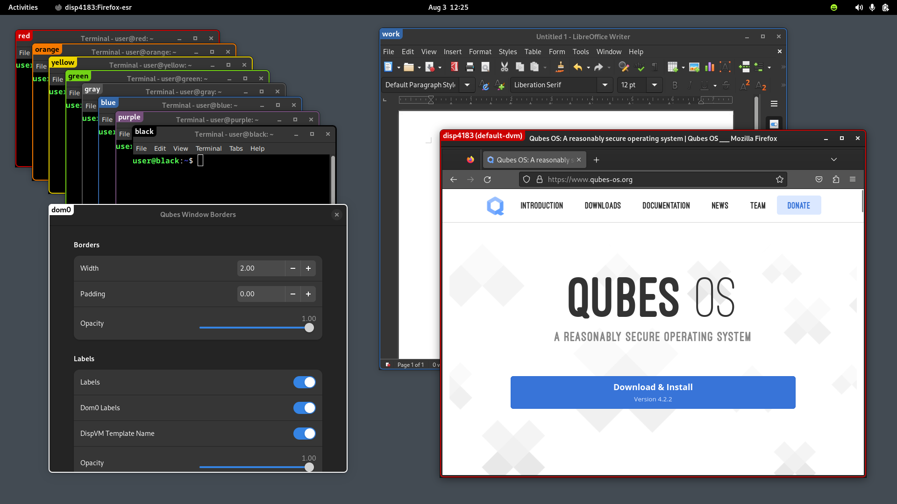

# Qubes Window Borders

A GNOME extension to draw colored window borders for VMs on Qubes OS

## Documentation

Documentation is available on [the wiki](https://github.com/apebl/gnome-ext-qubes-window-borders/wiki).

